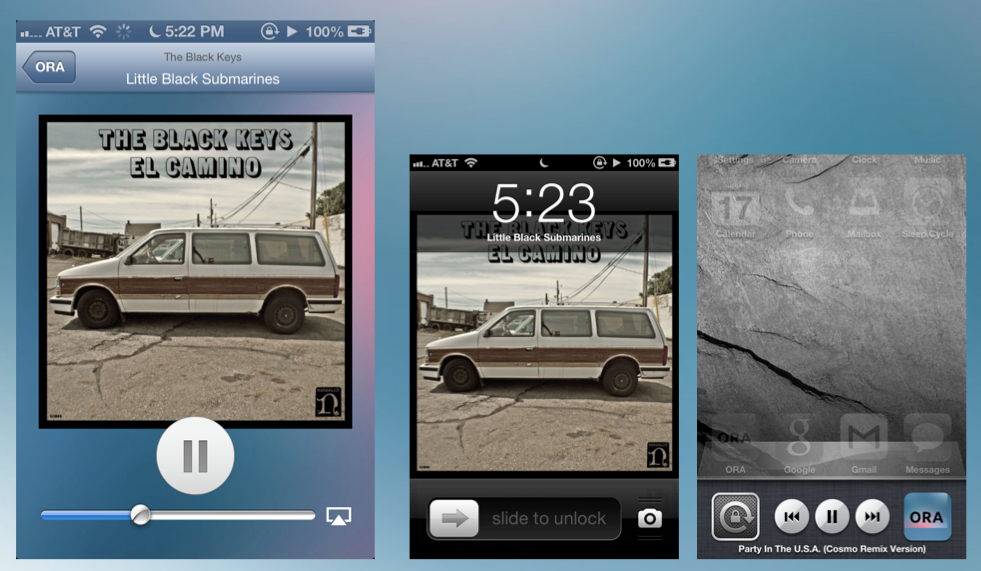

ORA is an online radio application for iOS

Users can listen to a live radio stream and view the title, artiste, and cover art for the currently playing track. A list of all previously played tracks is saved and displayed in a table. Users can visit this list and buy songs from Amazon mp3.

# The Live Stream

The live stream is implemented in the LiveAudioStream class as a wrapper around AVPlayer. To keep the tunes flowing as users move around through different controllers, the stream is provided as a shared singleton instance of LiveAudioStream.

# Metadata 

Metadata for the currently playing track is fetched from a JSON endpoint (CSRDSMetadataFetcher) and marshaled into a CoreData-backed Metadata model. This process is mediated by a CSRDSCoreDataConnector class which manages the updating and retrieval of Metadata objects.

New or different metadata sources can be integrated by creating a new category on Metadata and classes to fill the Connector and Fetcher roles. 

Images are cached to disk through a layered storage system comprised of CachedImage, URLCache, and FileStorage classes.

# iOS Integration

### Background Audio

Background audio playback is made possible by a compile-time directive in the project's build settings (Targets > Info > Required background modes > App plays audio) and runtime directives in AppDelegate:

    [[AVAudioSession sharedInstance] setDelegate:self];
    [[AVAudioSession sharedInstance] setCategory:AVAudioSessionCategoryPlayback error:&sessionError];

### Now Playing Info

Information about the currently playing track is provided to iOS by way of the MPNowPlayingInfoCenter.

    MPMediaItemArtwork *art = [[MPMediaItemArtwork alloc] initWithImage:image];
    nowPlayingInfo = @{MPMediaItemPropertyArtist:metadata.artiste,
                       MPMediaItemPropertyArtwork:art,
                       MPMediaItemPropertyTitle:metadata.title};
                       
    [[MPNowPlayingInfoCenter defaultCenter] setNowPlayingInfo:nowPlayingInfo];

### iOS Playback Control

The NowPlayingViewController responds to remote control messages, so users can control playback from the multitasking bar and lock screen.

    [[UIApplication sharedApplication] beginReceivingRemoteControlEvents];
    [self becomeFirstResponder];

# CoreData 

The application performs all CoreData fetch and update operations on the main thread using a shared singleton instance of NSManagedObjectContext.

# Animations

A PlayPauseButton subclass of UIView implements a spin animation to let the user know the stream is loading.

# Custom UI

UIBuyButton is a handcrafted, custom UIButton integrated with ORA as a category (UITableViewCell+BuyButton) to be used as a custom AccessoryView.

# Amazon

When users click on previously played tracks in the HistoryTVC, ORA presents a UIWebView where they can listen to the a preview or purchase the song from Amazon mp3.

# Covert Art Gallery

Users can flip through cover art presented in a UICollectionView.
